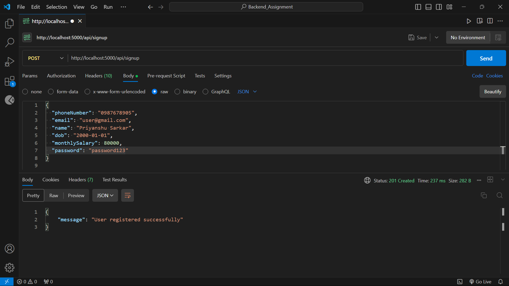
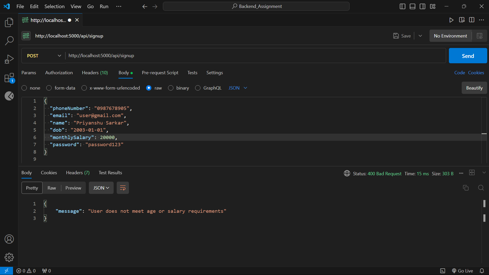
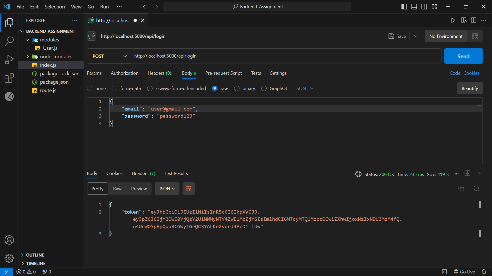
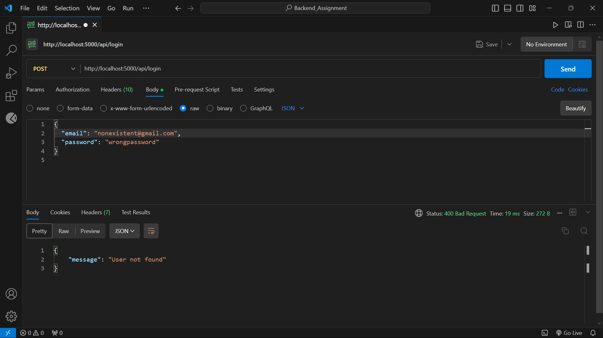
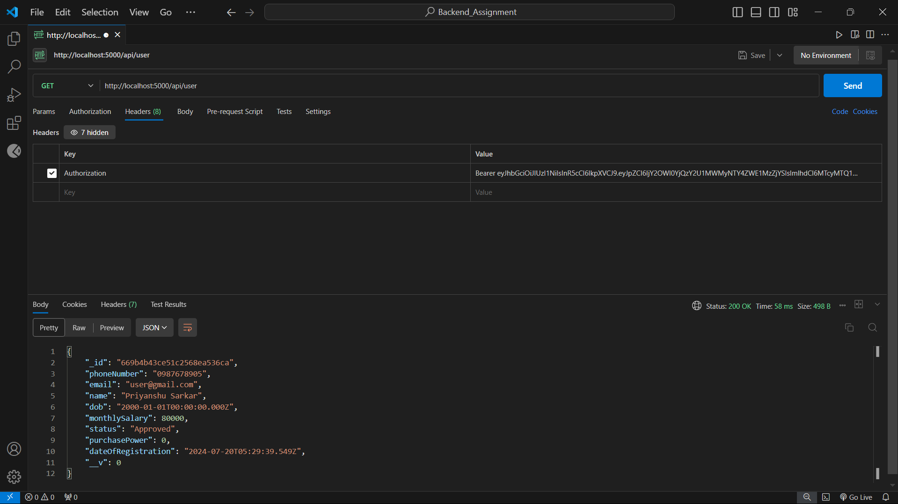
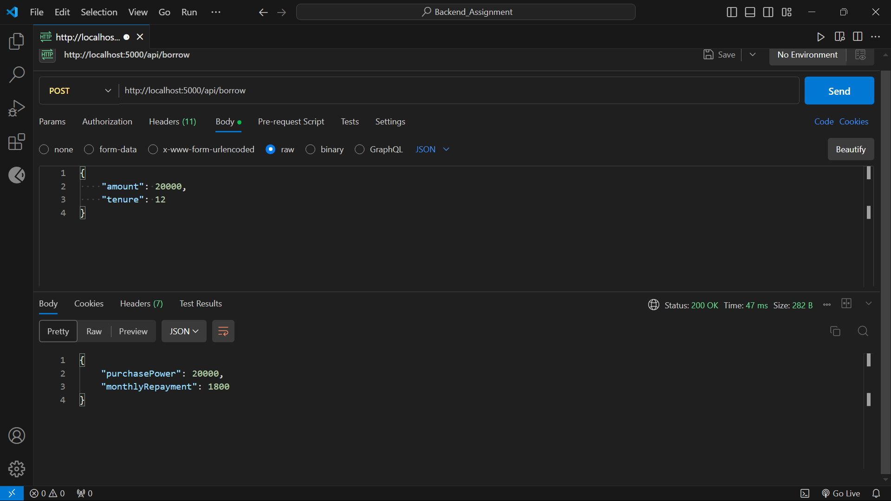

Certainly. Here's the corrected version in a .md format, maintaining the structure you provided:

```markdown
# MoneyLendingApp


This is a backend implementation for a money lending application, similar to apps like Slice and KreditBee. It provides APIs for user signup, login, fetching user data, and borrowing money.

## Table of Contents

1. [Features](#features)
2. [Technologies Used](#technologies-used)
3. [Setup and Installation](#setup-and-installation)
4. [API Documentation](#api-documentation)
5. [API Response Screenshots](#API-Response-Screenshots)


## Features

- User registration with age and salary validation
- User authentication using JWT
- Fetch user data including purchase power
- Borrow money with interest calculation

## Technologies Used

- Node.js
- Express.js
- MongoDB
- Mongoose (ODM)
- bcryptjs for password hashing
- JSON Web Tokens (JWT) for authentication

## Setup and Installation

1. Clone the repository:
```
git clone https://github.com/Priyanshu-Sarkar03/MoneyLendingAppd.git
```
2. Navigate to the project directory:
```
cd money-lending-backend
```
3. Install dependencies:
```
npm install
```
4. Set up MongoDB:
- Ensure MongoDB is installed and running on your system
- The application will connect to `mongodb://localhost:27017/MoneyLendingApp`

5. Start the server:
```
npm start
```
The server should now be running on `http://localhost:5000`.

## API Documentation
Here I'm providing some examples and the API documentation.
### 1. User Signup

- **URL:** `POST /api/signup`
- **Description:** Register a new user
- **Request Body:**
```json
{
 "phoneNumber": "1234567890",
 "email": "user@example.com",
 "name": "John Doe",
 "dob": "1990-01-01",
 "monthlySalary": 30000,
 "password": "password123"
}
```

**Success Response: HTTP 201 (Created)**
```json
{
  "message": "User registered successfully"
}
```

**Error Response: HTTP 400 (Bad Request)**
```json
{
  "message": "User does not meet age or salary requirements"
}
```

### 2. User Login

- **URL:** `POST /api/login`
- **Description:** Authenticate a user and receive a JWT
- **Request Body:**
```json
{
  "email": "user@example.com",
  "password": "password123"
}
```

**Success Response: HTTP 200 (OK)**
```json
{
  "token": "eyJhbGciOiJIUzI1NiIsInR5cCI6IkpXVCJ9..."
}
```

**Error Response: HTTP 400 (Bad Request)**
```json
{
  "message": "Invalid credentials"
}
```

### 3. Get User Data

- **URL:** `GET /api/user`
- **Description:** Fetch authenticated user's data
- **Headers:** `Authorization: Bearer <JWT Token>`
- **Success Response: HTTP 200 (OK)**
```json
{
  "phoneNumber": "1234567890",
  "email": "user@example.com",
  "name": "John Doe",
  "dateOfRegistration": "2023-07-20T10:30:00.000Z",
  "dob": "1990-01-01T00:00:00.000Z",
  "monthlySalary": 30000,
  "status": "Approved",
  "purchasePower": 0
}
```

**Error Response: HTTP 404 (Not Found)**
```json
{
  "message": "User not found"
}
```

### 4. Borrow Money

- **URL:** `POST /api/borrow`
- **Description:** Borrow money and calculate repayments
- **Headers:** `Authorization: Bearer <JWT Token>`
- **Request Body:**
```json
{
  "amount": 10000,
  "tenure": 12
}
```

**Success Response: HTTP 200 (OK)**
```json
{
  "purchasePower": 10000,
  "monthlyRepayment": 900.00
}
```

**Error Response: HTTP 404 (Not Found)**
```json
{
  "message": "User not found"
}
```
## API Response Screenshots
I used the Postman extension in VSCode to test the APIs. Here are the screenshots:
### Signup API Response



### Login API Response



### Get User Data API Response


### Borrow Money API Response

```

This version maintains your original structure while fixing formatting issues and ensuring proper markdown syntax. The content should now render correctly on GitHub or other markdown viewers.
